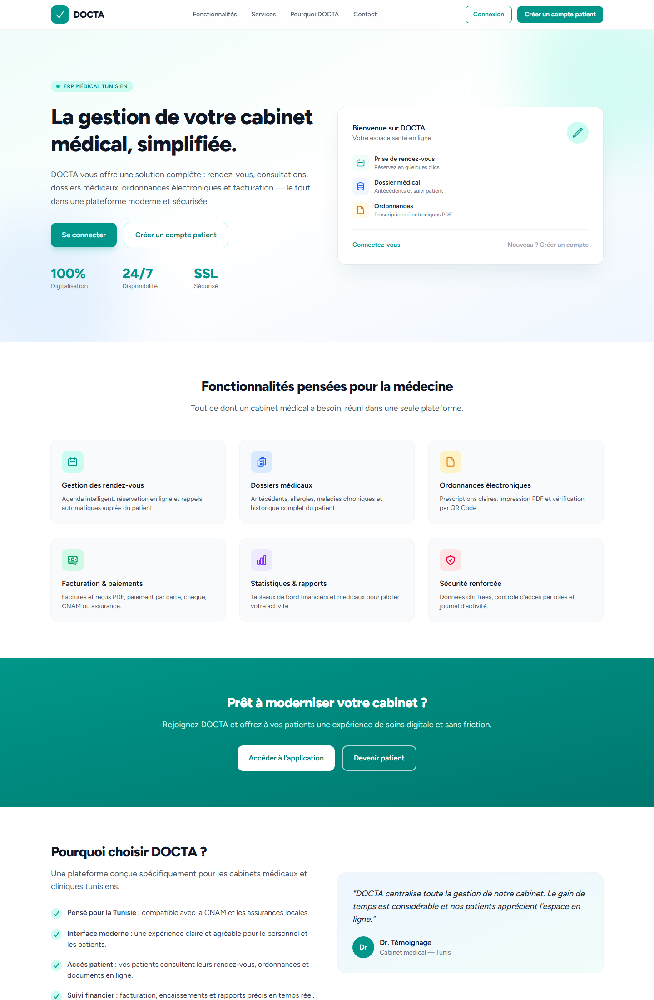

<div align="center">

# 🏥 DOCTA — ERP Médical

**La gestion du cabinet médical, simplifiée.**

[](https://laravel.com)
[](https://www.php.net)
[](https://www.mysql.com)
[](https://filamentphp.com)
[](https://tailwindcss.com)

*Plateforme ERP médicale professionnelle pour la gestion complète des cabinets médicaux tunisiens.*

</div>

---

## 🌟 Aperçu — Page d'accueil

<div align="center">



</div>

DOCTA est une solution tout-en-un dédiée aux **cabinets médicaux tunisiens** : patients, rendez-vous, consultations, dossiers médicaux, ordonnances électroniques et facturation — réunis dans une interface moderne, sécurisée et multirôles.

---

## 📋 Table des matières

- [💡 À propos](#-à-propos)
- [✨ Fonctionnalités](#-fonctionnalités)
- [🛠️ Stack technique](#-stack-technique)
- [🏗️ Architecture du projet](#-architecture-du-projet)
- [👥 Gestion des utilisateurs et permissions](#-gestion-des-utilisateurs-et-permissions)
- [🧩 Modules métier](#-modules-métier)
- [📂 Gestion des fichiers](#-gestion-des-fichiers)
- [🖨️ Génération PDF](#-génération-pdf)
- [🔔 Notifications](#-notifications)
- [🔒 Sécurité et audit](#-sécurité-et-audit)
- [🗄️ Base de données](#-base-de-données)
- [⚙️ Installation](#-installation)
- [🚀 Utilisation](#-utilisation)
- [🧪 Tests](#-tests)
- [🗺️ Phases de développement](#-phases-de-développement)
- [📐 Conventions de code](#-conventions-de-code)

---

## 💡 À propos

Les cabinets médicaux tunisiens ont besoin d'un outil unique pour gérer l'ensemble de leur activité administrative et médicale. **DOCTA** centralise :

| | |
|---|---|
| 👨‍⚕️ | La gestion des **médecins** et **secrétaires** |
| 🧑‍🤝‍🧑 | Le suivi complet des **patients** |
| 📅 | La planification des **rendez-vous** avec agenda |
| 🩺 | Les **consultations** et **dossiers médicaux** |
| 💊 | Les **ordonnances** imprimables (PDF + QR Code) |
| 💰 | La **facturation**, les **paiements** et les statistiques financières |

---

## ✨ Fonctionnalités

| Fonctionnalité | Description |
|---|---|
| 🔐 Authentification | Sessions sécurisées via Laravel Breeze |
| 🛡️ Rôles & Permissions | Gestion fine des accès avec `spatie/laravel-permission` |
| 🎛️ Panneau d'administration | Back-office complet FilamentPHP 4 |
| 📊 Tableau de bord | Statistiques temps réel (patients, RDV, CA…) |
| 🗂️ CRUD complets | Médecins, secrétaires, patients, RDV, factures… |
| 🔍 Recherche globale | Retrouver rapidement patients et documents |
| 🖨️ Documents PDF | Ordonnances, factures, certificats |
| 📁 Gestion documentaire | Photos et documents via Spatie Media Library |
| 📜 Journal d'audit | Traçabilité des actions via Spatie Activity Log |
| 🔔 Notifications | Base de données + Email |

---

## 🛠️ Stack technique

### Backend

| Technologie | Usage |
|---|---|
| **PHP 8.4+** | Langage serveur |
| **Laravel 13** | Framework principal |
| **MySQL 8** | Base de données relationnelle |
| **Eloquent ORM** | Couche d'accès aux données |
| **Service Container** | Injection de dépendances |
| **Events / Listeners** | Réactivité métier |
| **Jobs / Queues** | Traitement asynchrone |
| **Notifications** | Alertes multi-canaux |

### Authentification

- **Laravel Breeze** (Blade + Session Authentication)

### Administration

- **FilamentPHP 4** : Resources, Forms, Tables, Widgets, Actions

### Frontend

- **Livewire**
- **Alpine.js**
- **Tailwind CSS**

### Packages clés

| Package | Rôle |
|---|---|
| `spatie/laravel-permission` | Rôles et permissions |
| `spatie/laravel-medialibrary` | Gestion des fichiers et médias |
| `spatie/laravel-activitylog` | Journal d'activité |
| `barryvdh/laravel-dompdf` | Génération de PDF |
| `filament/spatie-laravel-media-library-plugin` | Intégration médias dans Filament |
| `phpoffice/phpspreadsheet` | Export/import de données |

### Environnement local

- **Laragon** (Apache + MySQL + PHP 8.4) sous Windows

---

## 🏗️ Architecture du projet

Le projet respecte les principes **Clean Code**, **SOLID**, **DRY**, **KISS** et **PSR-12**.

```
app/
├── Models/            # Modèles Eloquent
├── Services/          # Logique métier
├── Repositories/      # Accès aux données
├── Actions/           # Actions métier isolées
├── DTO/               # Objets de transfert de données
├── Enums/             # Énumérations (statuts, etc.)
├── Policies/          # Autorisations
├── Observers/         # Événements modèles
├── Notifications/     # Notifications applicatives
└── Events/            # Événements domaine

Modules/
├── Administration/
├── Patients/
├── Doctors/
├── Appointments/
├── Consultations/
├── MedicalRecords/
├── Billing/
├── Reports/
└── Settings/
```

---

## 👥 Gestion des utilisateurs et permissions

### Rôles

| Rôle | Description |
|---|---|
| `super_admin` | Accès total à la plateforme |
| `admin` | Administration du cabinet |
| `doctor` | Consultations, ordonnances, dossiers |
| `secretary` | Agenda, patients, encaissements |
| `patient` | Espace patient |
| `accountant` | Comptabilité et facturation |

### Permissions

```
users.view · users.create · users.update · users.delete
patients.view · patients.create · patients.update · patients.delete
appointments.manage
consultations.manage
billing.manage
reports.view
```

---

## 🧩 Modules métier

### Module Administration

Panneau Filament Admin avec :

- Gestion des utilisateurs, rôles et permissions
- Paramètres du cabinet
- Journal d'activité
- Sauvegardes

**Dashboard Admin — Widgets :**

| Widget | Description |
|---|---|
| 👥 Patients | Nombre de patients |
| 👨‍⚕️ Médecins | Nombre de médecins |
| 📅 Rendez-vous | Rendez-vous du jour |
| 💰 Chiffre d'affaires | Revenu cumulé |
| 🩺 Consultations | Consultations mensuelles |
| 💳 Paiements | Encaissements récents |

### Module Médecins

Modèle `Doctor` :

```text
id · user_id · first_name · last_name · speciality · order_number
phone · email · address · city · governorate · photo · status
created_at · updated_at
```

Fonctions :

- CRUD Filament
- Recherche
- Filtre par spécialité
- Profil médecin

### Module Secrétaires

Modèle `Secretary` :

```text
id · user_id · first_name · last_name · phone · email · address · status
```

Fonctions :

- Gestion de l'agenda
- Création de patients
- Gestion des rendez-vous
- Encaissement

### Module Patients

Modèle `Patient` :

```text
id · patient_number · first_name · last_name · gender · birth_date · photo
cin · phone · email · address · city · governorate · profession
blood_group · cnam_number · insurance · emergency_contact · emergency_phone
notes · status
```

Numérotation automatique :

```text
PAT-000001 → PAT-000002 → PAT-000003 → …
```

Fonctions :

- CRUD Filament
- Recherche globale
- Fiche patient
- Historique médical

### Module Rendez-vous

Modèle `Appointment` :

```text
id · patient_id · doctor_id · date · start_time · end_time · status · reason · notes
```

Statuts disponibles :

| Statut | Signification |
|---|---|
| `pending` | En attente |
| `confirmed` | Confirmé |
| `completed` | Terminé |
| `cancelled` | Annulé |
| `absent` | Patient absent |

Fonctions :

- Calendrier Filament
- Notifications (nouveau RDV, confirmation…)

### Module Consultations

Modèle `Consultation` :

```text
id · patient_id · doctor_id · appointment_id · consultation_date · reason
diagnosis · observations · weight · height · temperature
blood_pressure · heart_rate · notes
```

Fonctions :

- Historique des consultations
- Diagnostic
- Suivi patient

### Module Dossier médical

Modèle `MedicalRecord`, contenant :

- Antécédents
- Allergies
- Maladies chroniques
- Vaccinations
- Documents

### Module Ordonnances

Modèles `Prescription` + items :

```text
medicine · dosage · frequency · duration · instructions
```

Fonctions :

- Génération PDF
- Impression
- QR Code de vérification

### Module Facturation

Modèles `Invoice` + `InvoiceItems`.

Moyens de paiement acceptés :

| Mode | Description |
|---|---|
| `cash` | Espèces |
| `card` | Carte bancaire |
| `check` | Chèque |
| `cnam` | CNAM |
| `insurance` | Assurance privée |

Fonctions :

- Factures PDF
- Reçus de paiement
- Statistiques financières

---

## 📂 Gestion des fichiers

Via **spatie/laravel-medialibrary** :

- Photos des patients
- Documents médicaux
- Ordonnances scannées
- Résultats d'analyses

---

## 🖨️ Génération PDF

Via **barryvdh/laravel-dompdf** :

- 📄 Ordonnance PDF
- 🧾 Facture PDF
- 📜 Certificat médical PDF

---

## 🔔 Notifications

Basées sur le système natif de Laravel.

**Canaux :**

- Database
- Email

**Événements notifiés :**

- Nouveau rendez-vous
- Confirmation de rendez-vous
- Paiement reçu

---

## 🔒 Sécurité et audit

Mesures obligatoires appliquées :

- ✅ Policies Laravel (autorisation par rôle)
- ✅ Validation via FormRequest
- ✅ Protection CSRF
- ✅ Authorization stricte
- ✅ Audit Logs

Traçabilité assurée par **spatie/laravel-activitylog** :

- Connexions
- Modifications de dossier médical
- Suppressions
- Consultations sensibles

---

## 🗄️ Base de données

Toutes les tables suivent la même structure de base :

```text
id · created_at · updated_at · deleted_at
```

Bonnes pratiques appliquées :

- **SoftDeletes** sur tous les modèles
- **Foreign Keys** avec contraintes
- **Index** pour les performances
- **Constraints** pour l'intégrité des données

---

## ⚙️ Installation

### Prérequis

- PHP ≥ 8.4
- Composer
- Node.js + npm
- MySQL 8
- Laragon (recommandé sous Windows)

### Étapes

```bash
# 1. Cloner le projet
git clone <repository-url> docta
cd docta

# 2. Installer les dépendances PHP
composer install

# 3. Configurer l'environnement
copy .env.example .env
php artisan key:generate

# 4. Configurer la base de données dans .env
DB_CONNECTION=mysql
DB_HOST=127.0.0.1
DB_PORT=3306
DB_DATABASE=docta
DB_USERNAME=root
DB_PASSWORD=

# 5. Exécuter les migrations et seeders
php artisan migrate --seed

# 6. Installer les dépendances frontend et compiler
npm install
npm run build

# 7. Lancer le serveur de développement
php artisan serve
```

> 💡 **Astuce** : `composer setup` exécute automatiquement l'installation complète, et `composer dev` lance serveur, queues, logs et Vite simultanément.

---

## 🚀 Utilisation

1. Accéder à l'application : `http://localhost:8000`
2. Se connecter avec un compte administrateur créé par le seeder
3. Accéder au panneau Filament Admin : `/admin`
4. Configurer les rôles, créer médecins et secrétaires
5. Commencer à enregistrer patients et rendez-vous

---

## 🧪 Tests

Le projet utilise **PHPUnit** avec des tests Feature et Unit couvrant :

- Authentification
- Permissions et rôles
- CRUD patients
- Rendez-vous
- Facturation

```bash
# Lancer toute la suite de tests
composer test
# ou
php artisan test
```

---

## 🗺️ Phases de développement

Le projet est construit progressivement, module par module :

| Phase | Contenu | Statut |
|---|---|---|
| **Phase 1** | Installation Laravel 13, Breeze, Filament, Authentification, Rôles & Permissions, Dashboard | ✅ |
| **Phase 2** | Médecins, Secrétaires, Patients | 🔄 |
| **Phase 3** | Rendez-vous, Agenda, Notifications | ⏳ |
| **Phase 4** | Consultations, Dossier médical, Ordonnances | ⏳ |
| **Phase 5** | Facturation, Paiements, Rapports | ⏳ |

---

## 📐 Conventions de code

Chaque nouvelle fonctionnalité doit inclure :

1. Migration
2. Model + Relations Eloquent
3. Factory
4. Seeder
5. Policy
6. Service
7. Filament Resource
8. Tests

**Règles strictes :**

- ❌ Ne jamais dupliquer du code
- ❌ Ne jamais modifier plusieurs modules sans validation
- ❌ Ne jamais supprimer du code existant
- ❌ Ne jamais ignorer les erreurs Laravel
- ❌ Pas de packages superflus

---

## 🎯 Objectif

Faire de **DOCTA** un ERP médical professionnel, fiable et prêt à être commercialisé auprès des cabinets médicaux tunisiens.

---

<div align="center">

**DOCTA** — La gestion du cabinet médical, simplifiée.

*© 2026 DOCTA. Tous droits réservés.*

</div>
